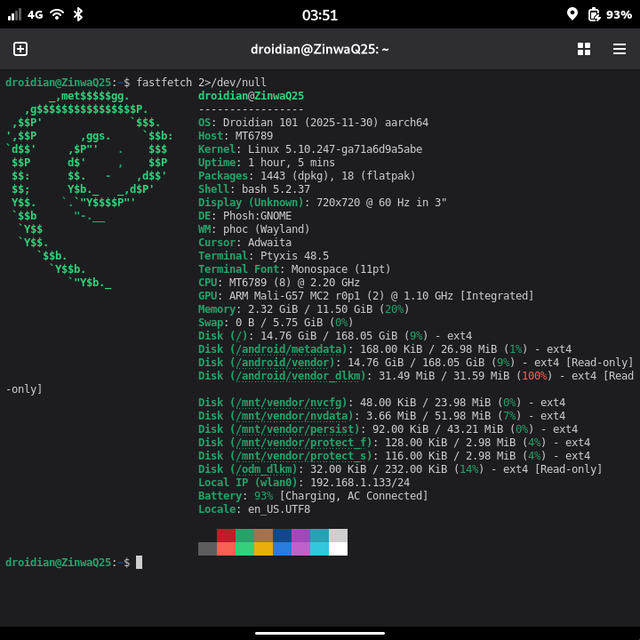
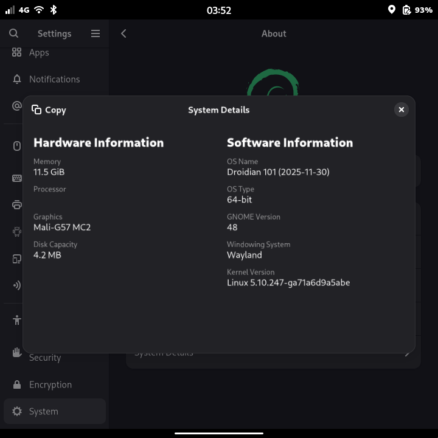
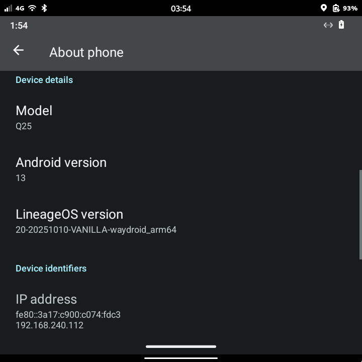
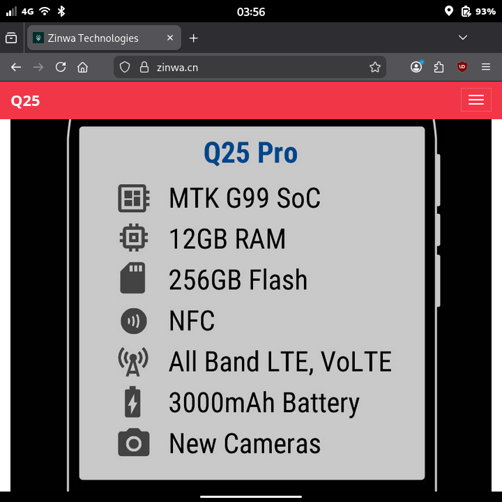
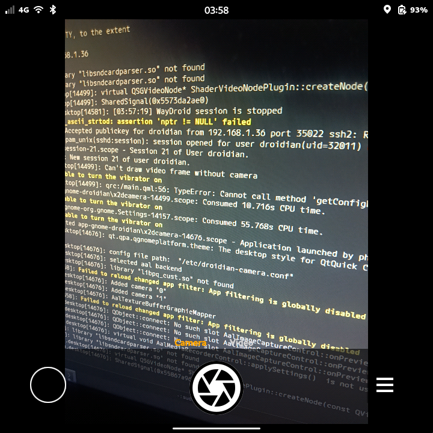

# droidian-zinwa-q25
Running [Droidian](https://droidian.org) on the [Zinwa Q25](https://en.wikipedia.org/wiki/Zinwa_Q25) (Blackberry Classic restomod).

. | . | .
-- | -- | --
 |  | 
 |  | 

## Special features
- Android multiboot support (with Droidian on internal storage or SD card) as first class citizen
- Custom desktop-oriented physical keyboard layout setup via https://github.com/rvaiya/keyd
- Integrated https://github.com/kmscon/kmscon as a system recovery path even when on the go
  - Disabled on rootfs by default for now due to delaying boot to Phosh at times *much* more + has weird kernel key repeat bug
    - `sudo systemctl unmask kmsconvt@tty1` to enable anyway (and `sudo systemctl start kmsconvt@tty1` to start without rebooting)
  - Online while fully booted toggled via `Ctrl` + `Alt` + `Call end`, Phosh etc graphical running apps will close
  - Offline from initramfs in "recovery mode" (after FDE unlock if setup)

## Installation, current status etc
Check out [the wiki](../../wiki)!

## Support
- GitHub: [discussions right here](../../discussions)
- Discord: [BB Revival](https://discord.gg/D2P7UqFdXz) -> [#community-contributions (Droidian)](https://discord.com/channels/1356921788038119556/1444055679814865069)
- Telegram: [official @DroidianLinux](https://t.me/DroidianLinux)
